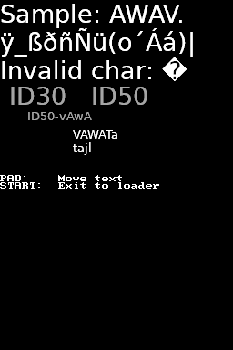

# LibDSF

## 1. Introduction

This is a library written in C to render text from fonts generated by
[BMFont](https://www.angelcode.com/products/bmfont/). The name of the library
(LibDSF) comes from "DS Font library".

In order to use this library, download the **Bitmap Font Generator** tool (or
any other compatible tool), export the font image to PNG, and export the font
data in binary format.

This library can load font data from RAM or from the filesystem. It won't load
textures for you, you're in charge of converting the PNG files to a
DS-compatible format and loading them to RAM (and VRAM).

Currently, only fonts with one single PNG file are supported.

It supports drawing text as a bunch of quads, or generating a texture with the
text rendered by software so that it can be loaded as a texture and drawn as one
quad.

The software rendering routines support all NDS texture formats except for
Tex4x4 compressed textures.

Important: Your source code files (or text data files) need to be encoded as
UTF-8.

Note: If the replacement character � (`U+FFFD`) codepoint is included in the
font, it will be used to print missing characters in the font, or when the UTF-8
string has encoding errors.

## 2. Install

You can install this library with `wf-pacman` directly:

```bash
wf-pacman -Sy blocksds-libdsf
```

If you want to build the library from source, simply run this to build and
install the library in your BlocksDS environment:

```bash
make install
```

## 3. Example

Once you have installed the library, go to the folder of the example and run:

```bash
make
```

This will generate a NDS file that you can test with flashcards or emulators.



## License

This library is released under the Zlib license.
